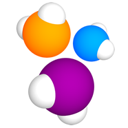
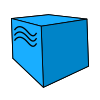

<h1 align="center"> :robot: Проект по автоматизации тестирования в рамках обучения на курсе QA.GURU </h1>

## :rocket: Technology stack

IntelliJ IDEA, Java, Gradle, JUnit5, Selenide, Selenoid, Jenkins, Allure Report, Allure TestOps, Jira, Github, Telegram

<p  align="center"

<code></code>
<code></code>
<code></code>
<code></code>
<code></code>
<code></code>
<code></code>
<code></code>
<code></code>
<code></code>
<code></code>
<code></code>
</p>

## UI tests:

> - [x] *Проверка блока контактов на странице c результатами поиска - найдено 0 результатов*
>- [x] *Проверка блока контактов на странице c результатами поиска - найдено больше 0*
>- [x] *Проверка компонентов информационного блока продукта R‑Vision SENSE*
>- [x] *Проверка перехода на блок 'Запрос на демо' по нажатию кнопки 'Запросить демо'*
>- [x] *Проверка перехода на блок 'Материалы' по нажатию кнопки 'Материалы'*

## :boom: Параметры запусков

Run tests with filled remote.properties:

```bash
gradle clean test
```

Serve report:

```bash
allure serve build/allure-results
```

### Allure Report

### Allure TestOps

### Jira

## Example of video with test running in Allure Report

## Notifications in Telegram channel


